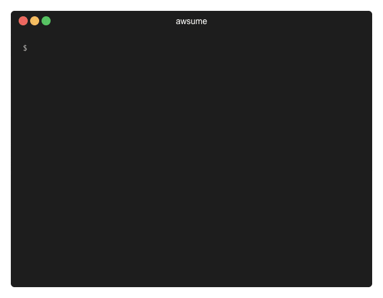

# AWSume: AWS Assume Made Awesome!

Awsume is a convenient way to manage session tokens and assume role credentials. Here's just a few of the many things you can do with it:

For a quick getting started guide, check out the [quick start](./general/quickstart.md) section.

## What's new?

Check the [changelog](./changelog) for more details.

::: tip
4.4.x - Infinite role-chainging support
:::

::: tip
4.3.x - Export awsume credentials to a profile in the `~/.aws/config` / `~/.aws/credentials` files
:::
